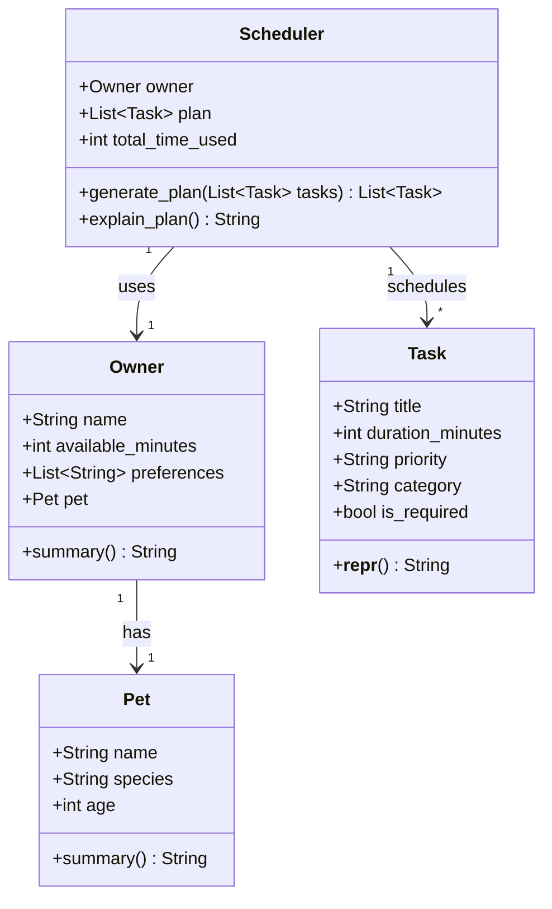

# PawPal+ Class Diagram

```mermaid
classDiagram
    class Pet {
        +String name
        +String species
        +int age
        +summary() String
    }

    class Owner {
        +String name
        +int available_minutes
        +List~String~ preferences
        +Pet pet
        +summary() String
    }

    class Task {
        +String title
        +int duration_minutes
        +String priority
        +String category
        +bool is_required
        +__repr__() String
    }

    class Scheduler {
        +Owner owner
        +List~Task~ plan
        +int total_time_used
        +generate_plan(List~Task~ tasks) List~Task~
        +explain_plan() String
    }

    Owner "1" --> "1" Pet : has
    Scheduler "1" --> "1" Owner : uses
    Scheduler "1" --> "*" Task : schedules
```
